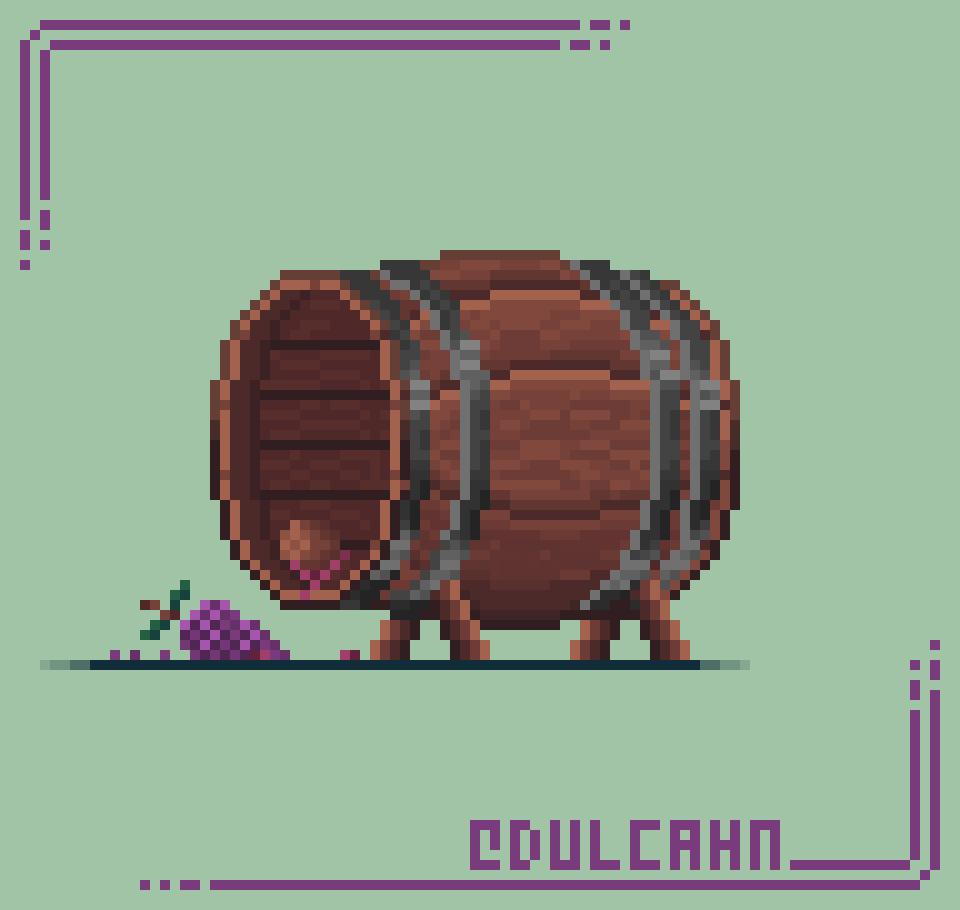

<div align="center">

  <!-- Header Banner Video -->
  <video src="https://github.com/yashasvi211/yashasvi211/raw/main/assets/main-environmentdesign-nocharacters.mp4" width="100%" autoplay loop muted playsinline></video>

  <!-- Typing SVG -->
  <a href="https://git.io/typing-svg">
    
  </a>

  <!-- Profile Views Badge (Cumulative Total) -->
  <br>
  
  
</div>

---

<!-- About Me Section -->
##  About Me



```yaml
name: Yashasvi
location: India 🇮🇳
role: Full-Stack Developer

currently_working_on: Building awesome things
currently_learning: New technologies every day
looking_to_collaborate: Open source projects
fun_fact: I code, therefore I am ☕
```

<br clear="right"/>

---

<!-- GitHub Metadata Badges -->
## 📋 GitHub At a Glance

<div align="center">


</div>

---

<!-- Tech Stack Section -->
## 🛠️ Tech Stack

<div align="center">

### Languages


### Frameworks & Libraries


### Tools & Platforms


</div>

---

<!-- GitHub Trophies Section -->
## 🏆 GitHub Trophies

<div align="center">
  
</div>

---

<!-- Coding Stats Section -->
## ⏱️ Weekly Development Breakdown

<!--START_SECTION:waka-->

```text
⏳ WakaTime stats are loading...
   Run the "WakaTime Stats" GitHub Action to populate this section.
```

<!--END_SECTION:waka-->

> ⚙️ **Auto-updates daily** — Set up [WakaTime](https://wakatime.com) + add `WAKATIME_API_KEY` & `GH_TOKEN` secrets to populate real data!

---

<!-- GitHub Stats Section -->
## 📊 GitHub Stats

<div align="center">
  
  
</div>

<br>

<div align="center">
  
</div>

<br>

<div align="center">
  
</div>

---

<!-- GitHub Profile Summary Cards -->
## 📈 Profile Summary

<div align="center">
  
  
</div>

<div align="center">
  
  
</div>

<div align="center">
  
</div>

---

<!-- Snake Animation -->
## 🐍 Contribution Snake

<div align="center">
  <picture>
    <source media="(prefers-color-scheme: dark)" srcset="https://raw.githubusercontent.com/yashasvi211/yashasvi211/output/github-snake-dark.svg">
    <source media="(prefers-color-scheme: light)" srcset="https://raw.githubusercontent.com/yashasvi211/yashasvi211/output/github-snake.svg">
    
  </picture>
</div>

---

<!-- Pac-Man Contribution Graph -->
## 👾 Pac-Man Contribution Graph

<div align="center">
  <picture>
    <source media="(prefers-color-scheme: dark)" srcset="https://raw.githubusercontent.com/yashasvi211/yashasvi211/output/pacman-contribution-graph-dark.svg">
    <source media="(prefers-color-scheme: light)" srcset="https://raw.githubusercontent.com/yashasvi211/yashasvi211/output/pacman-contribution-graph.svg">
    
  </picture>
</div>

---

<!-- Fun GIF Section -->
## 🎨 Creative Inspiration

<div align="center">
  
</div>

---

<!-- Connect Section -->
## 🤝 Connect With Me

<div align="center">

[](https://linkedin.com/in/yashasvi211)
[](https://twitter.com/yashasvi211)
[](https://github.com/yashasvi211)
[](mailto:your.email@example.com)

</div>

---

<div align="center">
  
</div>
