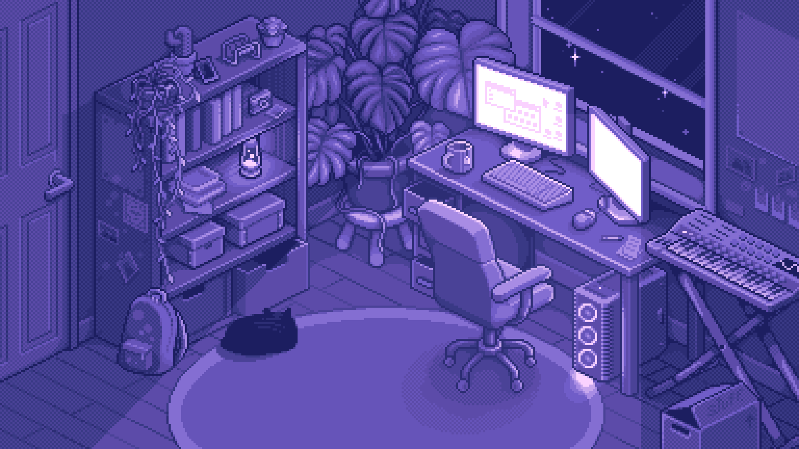

<h1 align="center">Hi 👋, I'm Yashasvi</h1>

<div align="center">
  
</div>

### 👨‍💻 About Me

I'm a passionate **Full-Stack Developer** from **India 🇮🇳**. I specialize in building robust and scalable web applications using modern technologies like React, Node.js, and Python. I enjoy exploring new tools and contributing to open-source projects. Currently, I'm focused on mastering advanced backend patterns and improving my frontend artistry.

---

### 🤝 Connect With Me

<div align="center">

[](https://leetcode.com/u/yashasvi211/)
[](https://twitter.com/yashasvi211)
[](https://steamcommunity.com/id/yashasvi211/)
[](mailto:your.email@example.com)

</div>

---

### 🛠️ Tech Stack

<div align="center">


</div>

---

### ⏱️ Weekly Development Breakdown

<!--START_SECTION:waka-->


**I'm an Early 🐤** 

```text
🌞 Morning                1231 commits        ███████████░░░░░░░░░░░░░░   43.00 % 
🌆 Daytime                834 commits         ███████░░░░░░░░░░░░░░░░░░   29.13 % 
🌃 Evening                698 commits         ██████░░░░░░░░░░░░░░░░░░░   24.38 % 
🌙 Night                  100 commits         █░░░░░░░░░░░░░░░░░░░░░░░░   03.49 % 
```
📅 **I'm Most Productive on Wednesday** 

```text
Monday                   385 commits         ███░░░░░░░░░░░░░░░░░░░░░░   13.45 % 
Tuesday                  462 commits         ████░░░░░░░░░░░░░░░░░░░░░   16.14 % 
Wednesday                543 commits         █████░░░░░░░░░░░░░░░░░░░░   18.97 % 
Thursday                 483 commits         ████░░░░░░░░░░░░░░░░░░░░░   16.87 % 
Friday                   529 commits         █████░░░░░░░░░░░░░░░░░░░░   18.48 % 
Saturday                 348 commits         ███░░░░░░░░░░░░░░░░░░░░░░   12.16 % 
Sunday                   113 commits         █░░░░░░░░░░░░░░░░░░░░░░░░   03.95 % 
```


📊 **This Week I Spent My Time On** 

```text
🕑︎ Time Zone: Asia/Kolkata
```


 Last Updated on 15/02/2026 12:32:17 UTC
<!--END_SECTION:waka-->

<div align="center">
  
</div>
